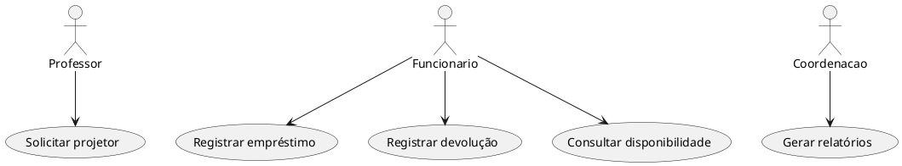

# Documento de Requisitos – Sistema de Gestão de Empréstimo de Projetores do CCT/Unifor

## 1. Documento de Visão

### 1.1 Nome do Projeto
Sistema de Gestão de Empréstimo de Projetores – CCT/Unifor

### 1.2 Contexto
Atualmente, professores do CCT da Universidade de Fortaleza precisam se deslocar até uma sala específica para retirar projetores quando necessitam utilizá-los em aula. Após o uso, o professor também precisa devolver o equipamento presencialmente.

A solução proposta consiste em centralizar o atendimento por meio de um funcionário responsável pela sala de projetores. O professor informa suas credenciais, solicita o equipamento, e o funcionário realiza a entrega, o registro do empréstimo e posteriormente registra a devolução.

### 1.3 Problema
O processo atual é manual, pouco rastreável e pouco eficiente. Não há controle sistematizado sobre quem retirou determinado projetor, em qual horário, para qual aula ou sala, nem sobre o estado do equipamento antes e depois do uso.

### 1.4 Objetivo Geral
Desenvolver uma solução que permita registrar, controlar e acompanhar o empréstimo e a devolução de projetores utilizados por professores do CCT.

### 1.5 Objetivos Específicos
- Reduzir o tempo gasto pelo professor no processo de retirada de projetores.
- Registrar formalmente os empréstimos e devoluções.
- Identificar o professor responsável por cada equipamento emprestado.
- Controlar a disponibilidade dos projetores.
- Registrar ocorrências, atrasos, danos ou falhas nos equipamentos.
- Gerar histórico de uso dos projetores.

---

# 2. Identificação de Stakeholders

| Stakeholder | Papel | Interesse |
|---|---|---|
| Professores do CCT | Solicitam projetores | Agilidade e disponibilidade |
| Funcionário responsável | Controla empréstimos | Organização do processo |
| Coordenação do CCT | Supervisiona o processo | Controle patrimonial |
| Setor de TI | Apoio técnico | Segurança e manutenção |
| Universidade | Beneficiada pela solução | Eficiência operacional |
| Alunos | Beneficiários indiretos | Menor atraso nas aulas |

---

# 3. Roteiro e Resultados de Entrevistas

## 3.1 Perguntas para Professores
1. Com que frequência utiliza projetores?
2. Quais dificuldades existem no processo atual?
3. O processo atual gera atrasos?
4. Quais informações deveriam ser registradas?
5. O que tornaria o processo mais eficiente?

## 3.2 Perguntas para Funcionários
1. Como os projetores são controlados atualmente?
2. Existe registro formal de empréstimos?
3. Quais problemas acontecem com frequência?
4. Como são tratadas devoluções atrasadas?
5. Quais funcionalidades seriam úteis?

## 3.3 Perguntas para Coordenação
1. Existem problemas administrativos relacionados aos projetores?
2. Há histórico de perdas ou danos?
3. Quais relatórios seriam importantes?
4. Existem regras institucionais para empréstimos?

## 3.4 Resultados Esperados
- Processo mais rápido.
- Melhor rastreabilidade.
- Controle de disponibilidade.
- Histórico de uso.
- Registro de danos e atrasos.

---

# 4. Requisitos

## 4.1 Requisitos Funcionais

| Código | Requisito |
|---|---|
| RF01 | Cadastrar professores |
| RF02 | Cadastrar funcionários |
| RF03 | Cadastrar projetores |
| RF04 | Consultar disponibilidade |
| RF05 | Registrar empréstimos |
| RF06 | Registrar devoluções |
| RF07 | Registrar horário de retirada |
| RF08 | Registrar horário de devolução |
| RF09 | Registrar ocorrências |
| RF10 | Gerar relatórios |

---

## 4.2 Requisitos Não Funcionais

| Código | Requisito |
|---|---|
| RNF01 | Interface simples e intuitiva |
| RNF02 | Resposta do sistema em até 3 segundos |
| RNF03 | Disponibilidade durante horário de aulas |
| RNF04 | Segurança dos dados |
| RNF05 | Controle de acesso |
| RNF06 | Responsividade |
| RNF07 | Histórico para auditoria |
| RNF08 | Backup periódico |

---

## 4.3 Regras de Negócio

| Código | Regra |
|---|---|
| RN01 | Apenas professores cadastrados podem solicitar projetores |
| RN02 | Apenas funcionários autorizados registram empréstimos |
| RN03 | Projetores indisponíveis não podem ser emprestados |
| RN04 | Empréstimos alteram status do projetor para “Emprestado” |
| RN05 | Devoluções alteram status para “Disponível” |
| RN06 | Projetores com defeito ficam em “Manutenção” |
| RN07 | Todo empréstimo deve possuir professor e horário registrados |

---

# 5. Backlog Priorizado

| Prioridade | Item |
|---|---|
| Alta | Cadastro de projetores |
| Alta | Cadastro de professores |
| Alta | Registro de empréstimos |
| Alta | Registro de devoluções |
| Média | Histórico de empréstimos |
| Média | Relatórios gerenciais |
| Média | Controle de atrasos |
| Média | Controle de permissões |

---

# 6. Diagramas UML

## 6.1 Diagrama de Casos de Uso

---

# 7. Considerações Finais

A solução proposta busca tornar o processo de empréstimo de projetores mais organizado, seguro e rastreável. O sistema reduz a dependência de controles manuais e melhora a eficiência operacional do CCT/Unifor.
