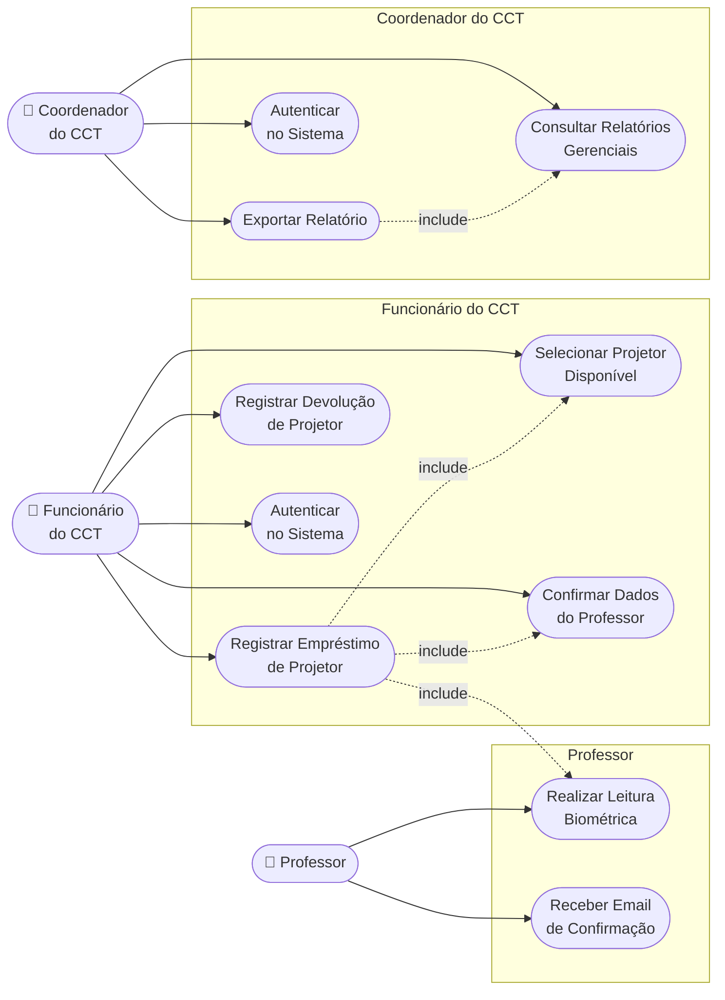
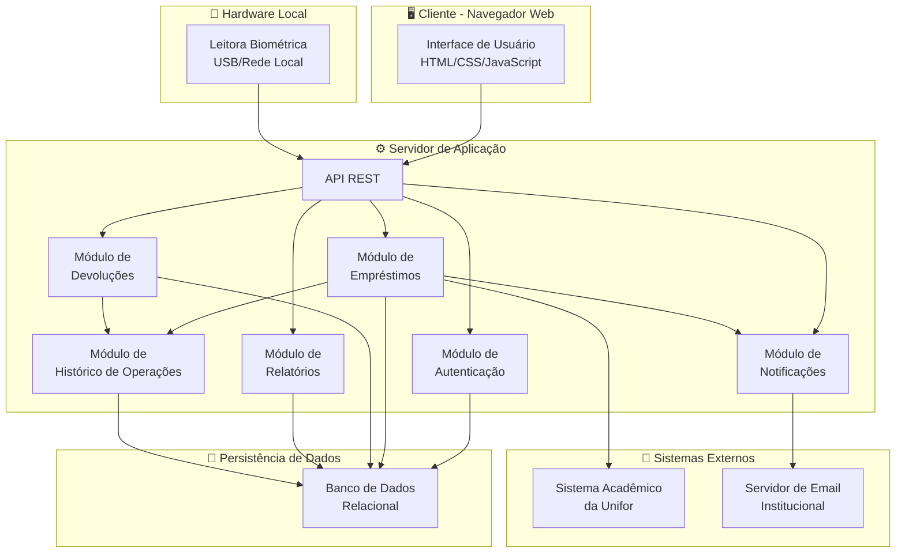
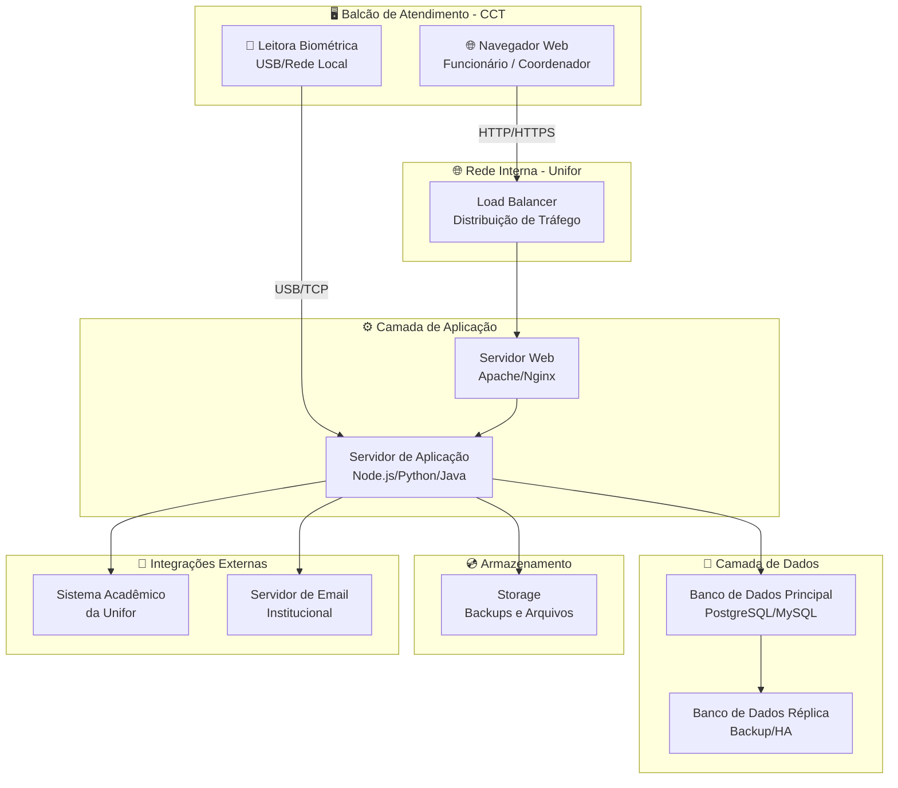
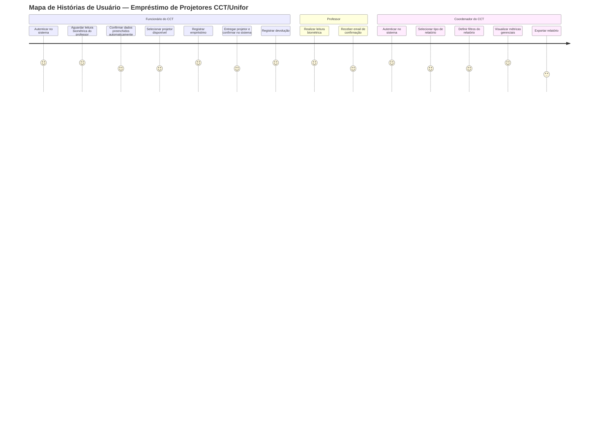

# Visão da Demanda (VD)

> **Sistema de Empréstimo de Projetores — CCT/Unifor**

## Histórico de Versões

| Data       | Versão | Descrição                                                                              | Autor             |
| ---------- | ------ | -------------------------------------------------------------------------------------- | ----------------- |
| 22/05/2026 | 1.0    | Criação inicial do documento de visão para o Sistema de Empréstimo de Projetores CCT/Unifor | Equipe do Projeto |

## 1. Objetivo

Definir a proposta de valor e o escopo do Sistema de Empréstimo de Projetores do CCT/Unifor, detalhando as necessidades dos funcionários do setor de empréstimos, dos professores solicitantes e do coordenador do departamento.

## 2. Proposta de Valor

O sistema permitirá modernizar e digitalizar o controle do empréstimo de projetores no CCT da Unifor, substituindo o processo manual baseado em formulários em papel e chave física por um fluxo digital com identificação biométrica, registro automatizado e geração de métricas gerenciais. Espera-se maior agilidade no atendimento, eliminação de perdas de chaves, rastreabilidade completa dos equipamentos e dados concretos para a gestão do acervo.

## 3. Descrição da Demanda

O sistema apoiará o funcionário do CCT na identificação biométrica do professor, no preenchimento automático do formulário virtual de empréstimo, no registro e controle de devoluções e no envio de notificações por email ao professor. O coordenador do CCT terá acesso a relatórios gerenciais com métricas de uso dos projetores. Todo o processo será digital, com autenticação de usuários por perfil de acesso e histórico completo de operações.

## 4. Partes Interessadas

| Nome                   | Papel              | Responsabilidades                                                       | Representante      |
|------------------------|--------------------|-------------------------------------------------------------------------|--------------------|
| CCT / Unifor           | Cliente            | Gerenciar projetores, autorizar empréstimos, consultar métricas         | Coordenador do CCT |
| Professor              | Beneficiário       | Solicitar projetor, realizar leitura biométrica, devolver equipamento   | —                  |
| Funcionário do CCT     | Usuário operador   | Registrar empréstimos e devoluções, operar o sistema                    | —                  |
| Coordenador do CCT     | Usuário gerencial  | Consultar relatórios e métricas de uso dos projetores                   | —                  |
| Equipe de TI           | Desenvolvimento    | Implementar e manter o sistema                                          | —                  |

## 5. Personas

### 5.1. Funcionário do CCT
- **Descrição:** Servidor responsável por gerenciar o acervo de projetores do departamento e atender os professores que solicitam o equipamento presencialmente.
- **Objetivo:** Registrar empréstimos e devoluções de forma rápida e sem preenchimento manual, mantendo controle preciso dos projetores disponíveis.

### 5.2. Professor
- **Descrição:** Docente do CCT que necessita de projetor para ministrar aulas e solicita o equipamento presencialmente ao funcionário do setor.
- **Objetivo:** Obter um projetor de forma ágil e receber confirmação do empréstimo realizado em seu nome, sem precisar preencher formulários longos.

### 5.3. Coordenador do CCT
- **Descrição:** Gestor responsável pela administração do departamento e pelo planejamento do uso dos recursos do CCT.
- **Objetivo:** Acessar métricas de uso dos projetores para embasar decisões gerenciais, como ampliação do acervo e alocação de recursos por turno.

## 6. Necessidades e Funcionalidades

### Necessidade 1: Identificação do professor por biometria

#### F1.1 Leitura biométrica do professor
- **Descrição:** Permite identificar o professor por meio da leitura de sua digital em leitora biométrica, sem necessidade de digitação de nome ou preenchimento manual de dados.
- **Incluída**
- **Atores:** Professor, Funcionário do CCT
- **Frequência:** Alta
- **Valor:** Alto

#### F1.2 Preenchimento automático do formulário virtual
- **Descrição:** Após a identificação biométrica, o sistema preenche automaticamente o formulário de empréstimo com nome completo, matrícula, disciplina e data/hora, consultando o Sistema Acadêmico da Unifor.
- **Incluída**
- **Atores:** Funcionário do CCT
- **Frequência:** Alta
- **Valor:** Alto

### Necessidade 2: Gestão de empréstimo de projetores

#### F2.1 Registro de empréstimo de projetor
- **Descrição:** Permite registrar o empréstimo de um projetor ao professor identificado, associando o equipamento — identificado por número único e código de barras — ao registro do professor no banco de dados.
- **Incluída**
- **Atores:** Funcionário do CCT
- **Frequência:** Alta
- **Valor:** Alto

#### F2.2 Seleção de projetor disponível por número e código de barras
- **Descrição:** O sistema exibe a lista de projetores com status "disponível", identificados por número único e código de barras, para seleção pelo funcionário no ato do empréstimo.
- **Incluída**
- **Atores:** Funcionário do CCT
- **Frequência:** Alta
- **Valor:** Alto

#### F2.3 Alerta de empréstimo em aberto do professor
- **Descrição:** Antes de prosseguir com o novo empréstimo, o sistema alerta o funcionário caso o professor já possua projetores emprestados e ainda não devolvidos, exibindo os detalhes dos empréstimos em aberto.
- **Incluída**
- **Atores:** Funcionário do CCT
- **Frequência:** Média
- **Valor:** Alto

### Necessidade 3: Gestão de devolução de projetores

#### F3.1 Registro de devolução de projetor
- **Descrição:** Permite registrar a devolução de um projetor entregue pelo professor ao funcionário, encerrando o empréstimo ativo e registrando data e hora da devolução.
- **Incluída**
- **Atores:** Funcionário do CCT
- **Frequência:** Alta
- **Valor:** Alto

#### F3.2 Atualização automática de status do projetor
- **Descrição:** Ao confirmar a devolução, o sistema atualiza automaticamente o status do projetor para "disponível", liberando-o imediatamente para novo empréstimo.
- **Incluída**
- **Atores:** Funcionário do CCT
- **Frequência:** Alta
- **Valor:** Alto

### Necessidade 4: Notificação ao professor

#### F4.1 Envio de email de confirmação de empréstimo
- **Descrição:** Após o registro do empréstimo, o sistema envia automaticamente um email ao endereço institucional do professor informando que um projetor foi emprestado em seu nome, com número de identificação do equipamento, data e horário.
- **Incluída**
- **Atores:** Sistema (automático)
- **Frequência:** Alta
- **Valor:** Médio

### Necessidade 5: Relatórios gerenciais para o coordenador

#### F5.1 Relatório de professores com maior frequência de uso
- **Descrição:** Exibe ranking dos professores que mais utilizaram projetores em um período selecionado, com filtros por semestre letivo.
- **Incluída**
- **Atores:** Coordenador do CCT
- **Frequência:** Baixa a média
- **Valor:** Alto

#### F5.2 Relatório de disciplinas com maior demanda
- **Descrição:** Exibe quais disciplinas concentram maior número de empréstimos de projetores, permitindo identificar áreas com maior necessidade do equipamento.
- **Incluída**
- **Atores:** Coordenador do CCT
- **Frequência:** Baixa a média
- **Valor:** Alto

#### F5.3 Relatório de horários de pico de utilização
- **Descrição:** Exibe os horários de aula com maior demanda de projetores, permitindo planejamento do atendimento e da disponibilidade do acervo.
- **Incluída**
- **Atores:** Coordenador do CCT
- **Frequência:** Baixa a média
- **Valor:** Alto

#### F5.4 Histórico de empréstimos por período
- **Descrição:** Exibe o histórico completo de empréstimos e devoluções com filtros por período e semestre letivo, com opção de exportação em PDF ou planilha.
- **Incluída**
- **Atores:** Coordenador do CCT
- **Frequência:** Baixa a média
- **Valor:** Médio

### Necessidade 6: Segurança, acesso e conformidade

#### F6.1 Autenticação de usuários por perfil de acesso
- **Descrição:** Garante que apenas funcionários e coordenador autenticados com credenciais institucionais acessem o sistema. O módulo de relatórios gerenciais é restrito ao perfil de coordenador.
- **Incluída**
- **Atores:** Funcionário do CCT, Coordenador do CCT
- **Frequência:** Sempre
- **Valor:** Alto

#### F6.2 Registro de histórico de operações
- **Descrição:** Mantém registro auditável de todos os empréstimos e devoluções, com identificação do funcionário responsável pela operação e carimbo de data e hora.
- **Incluída**
- **Atores:** Todos
- **Frequência:** Sempre
- **Valor:** Alto

#### F6.3 Alerta de estoque baixo de projetores
- **Descrição:** Quando o número de projetores disponíveis atingir 20% ou menos do total cadastrado, o sistema gera alerta automático ao administrador para ação preventiva.
- **Incluída**
- **Atores:** Administrador do Sistema
- **Frequência:** Condicional
- **Valor:** Alto

#### F6.4 Conformidade com a LGPD
- **Descrição:** O tratamento de dados pessoais dos professores (nome, matrícula, disciplinas e histórico de empréstimos) deve estar em conformidade com a Lei Geral de Proteção de Dados (Lei nº 13.709/2018) e com as políticas internas da Unifor.
- **Incluída**
- **Atores:** Todos
- **Frequência:** Sempre
- **Valor:** Alto

## 7. Arquitetura da Demanda

O sistema será composto por módulos de Autenticação, Empréstimos, Devoluções, Notificações e Relatórios. Utilizará banco de dados relacional e será acessível via navegadores web modernos nos computadores institucionais do CCT. Integrará com o Sistema Acadêmico da Unifor para obtenção de dados dos professores via identificador biométrico e com a leitora biométrica via conexão local. As notificações serão enviadas por meio do servidor de email institucional da Unifor.

### 7.1. Diagramas UML

#### 7.1.1. Diagrama de Caso de Uso

Ilustra os atores (Funcionário do CCT, Professor e Coordenador) e suas interações com os principais casos de uso do sistema.

#### 7.1.2. Diagrama de Componentes

Descreve os principais componentes do sistema e suas dependências.

**Componentes principais:**
- **Interface de Usuário** — Aplicação web responsiva acessível nos computadores institucionais do CCT
- **Leitora Biométrica** — Hardware de captura de digital conectado ao balcão de atendimento
- **Módulo de Autenticação** — Garante acesso seguro por perfil (funcionário e coordenador)
- **Módulos de Negócio** — Empréstimos, Devoluções, Notificações e Relatórios
- **Módulo de Histórico** — Registra todas as operações com carimbo de data/hora e responsável
- **API REST** — Orquestra a comunicação entre cliente, hardware e servidor
- **Banco de Dados Relacional** — Armazena todos os dados do sistema
- **Sistema Acadêmico da Unifor** — Integração para obtenção de dados do professor por identificador biométrico
- **Servidor de Email Institucional** — Envio de notificações de confirmação de empréstimo

#### 7.1.3. Diagrama de Implantação

Mostra como os componentes serão distribuídos nos ambientes de execução.

**Ambiente de execução:**
- **Balcão de Atendimento** — Computador institucional com navegador web e leitora biométrica conectada
- **Rede Interna Unifor** — Infraestrutura de rede da instituição, sem necessidade de acesso externo para os funcionários
- **Servidor Web** — Hospeda a aplicação e distribui requisições
- **Servidor de Aplicação** — Processa a lógica de negócio e orquestra integrações
- **Banco de Dados Principal** — Armazena dados operacionais de empréstimos e projetores
- **Banco de Dados Réplica** — Backup e alta disponibilidade
- **Storage** — Armazena arquivos e backups do sistema
- **Sistema Acadêmico da Unifor** — Integração via API autenticada e cifrada para dados dos professores
- **Servidor de Email** — Envio de notificações institucionais via SMTP

### Mapa de Histórias de Usuário

---

## Checklist de Validação do Documento de Visão

- [ ] O objetivo está claro e alinhado ao problema/necessidade?
- [ ] A proposta de valor é mensurável e relevante?
- [ ] Todas as partes interessadas estão listadas com papéis definidos?
- [ ] Existem pelo menos duas personas descritas?
- [ ] Todas as necessidades e funcionalidades estão relacionadas a atores?
- [ ] Há indicação de valor e frequência para cada funcionalidade?
- [ ] A arquitetura está ilustrada com os diagramas UML (Caso de Uso, Componentes e Implantação)?
- [ ] O documento está escrito em linguagem clara e objetiva?

---

> Consulte exemplos e dicas em: [Guia de Elaboração da Visão](../../Elicitacao/VisaoDemanda.md)
